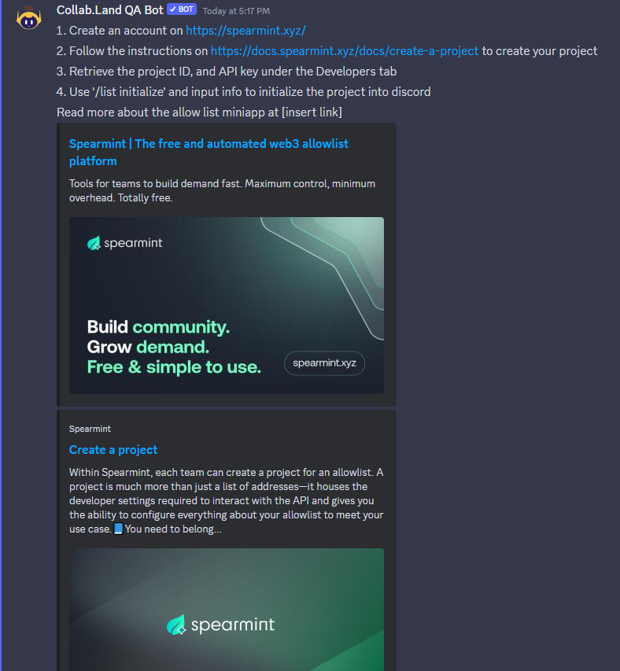

# @collabland/example-poll-action

This example illustrates how to implement a Collab action for Discord using
different interaction types:

- [Slash commands](https://discord.com/developers/docs/interactions/application-commands#slash-commands)
- [Interactions](https://discord.com/developers/docs/interactions/receiving-and-responding#interaction-object)
- [Responses](https://discord.com/developers/docs/interactions/receiving-and-responding#responding-to-an-interaction)
- [Buttons](https://discord.com/developers/docs/interactions/message-components#buttons)
- [Select menus](https://discord.com/developers/docs/interactions/message-components#select-menus)
- [Modals (with text inputs)](https://discord.com/developers/docs/interactions/message-components#text-inputs)

SPEARMINT API ALLOW LIST

# Try it out
In your terminal:
npm run build npm run server 
In NGROK:
ngrok http 3000

```

In your Discord server:
First, make sure you have the CollabLand Bot installed into your Discord server. You can find the bot here. https://collabland.freshdesk.com/support/solutions/articles/70000036689-discord-bot-walkthrough. Next, make sure the Test-Flight miniapp is downloaded from the marketplace. Type: 
/test-flight install <https-url-from-ngrok>/allow-list
in discord. Copy and paste your link from NGROK where instructed.
There are a few different commands. 
1. /list create - run this command to start the process. This will link you to Spearmint. To begin, first sign in with your wallet. You can do this through Metamask, WalletConnect, or Coinbase Wallet. Next, verify your email address to enable creator features for your account. Create your own team and then create a project. When creating a project, Spearmint offers three different options depending on what kind of mint process you need. Spearmint offers Raffle, First come, First served(FCFS), and Headless. Raffle is the most common type of project, which collects entries from a public registration page and randomly assigns winners. First come, First served marks the first users who register their entries as winners. Unlike the Raffle, it allows entry collection after finalization. Headless project has no registration page. Instead, it allows you to use Spearmint API to create and manage your own entries. This is useful if you want to use your own rules around who to place on the allowlist. After picking a project type, enter a name for your project. Add a description if needed. Pick the correct blockchain to mint on. Add an profile or banner image if wanted. From here, you can view the total entries and daily registrations. You also have access to your project ID, and have the ability to create an API key. When connecting Spearmint with our miniapp, you will need both the ProjectID and APIkey. 

2. /list initialize - This command connects your spearmint project with our Discord Bot miniapp. After entering your ProjectID, APIKey, Project name, and End Date, it will connect our Discord bot to Spearmint. 

3. /list status - This command is meant for the people who enter your allowlist draw to find out the status of their entry, whether that be selected, not selected, or still in the process of selecting winners. Creators of a project can run this command to be linked back to their Spearmint webpage where they can view the status of their project. 

```


```

```


